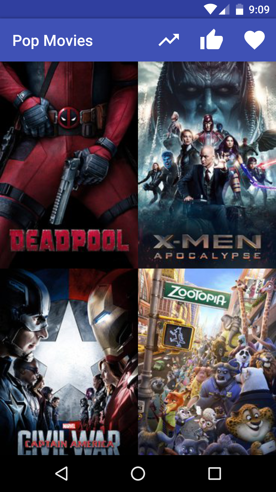
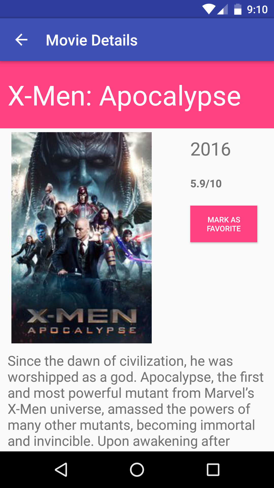
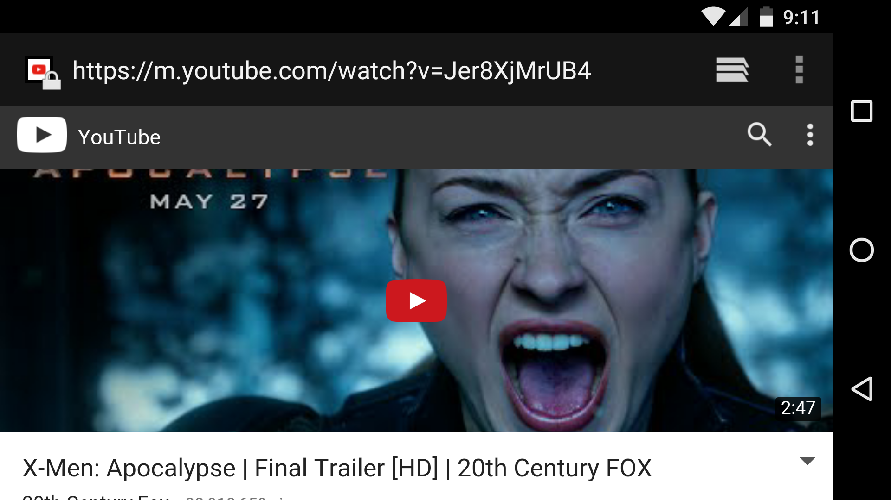

# popular-movies
Frist project for Udacity nanodegree. The first stage of this app loads movie posters from the web and load it on details screen. By the time the stage two is complete, it will be (fairly) optimized for tablet UI as well as saved the movie info, including the poster on a sqlite db. 

##Stage 1
Stage 1 will include two activities - main activity that shows a grid of movie posters gained from a web request and a details activity that will add more details about the movie that was selected. The posters will be sortable based on popularity as well as ratings.

##Stage 2
Stage 2 will make it even better by polishing it for a tablet UI. With the real estate now available, the tablet will have two fragments that will show the movie posters as well as the details. Whether on tablet or on the phone, the movie will be available to be added for an offline mode which will save the data including the picture into a sqlite database. The trailers will be listed on the details fragment, which when clicked will open up youtube for display.

### Screenshots:

